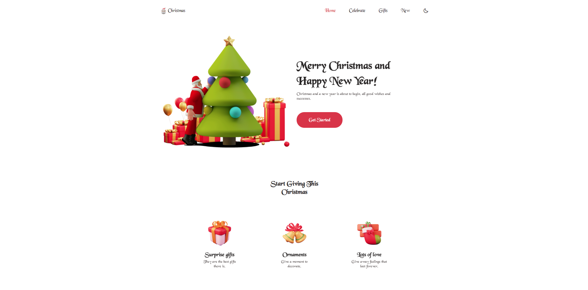
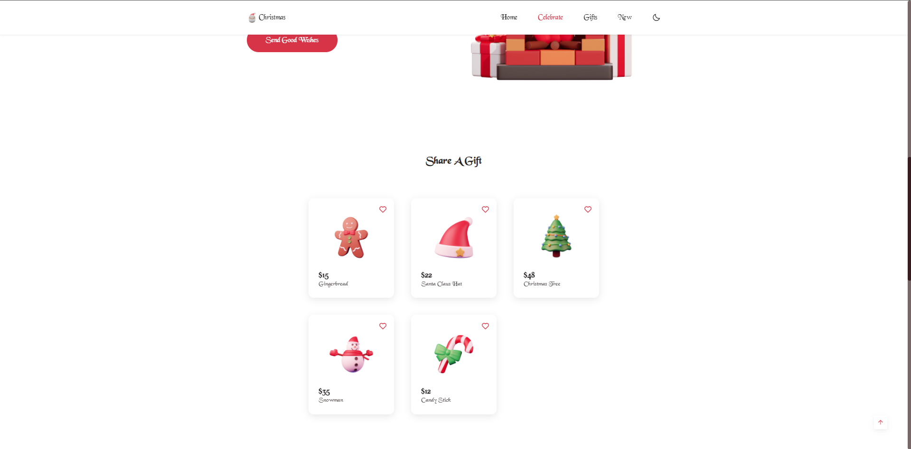
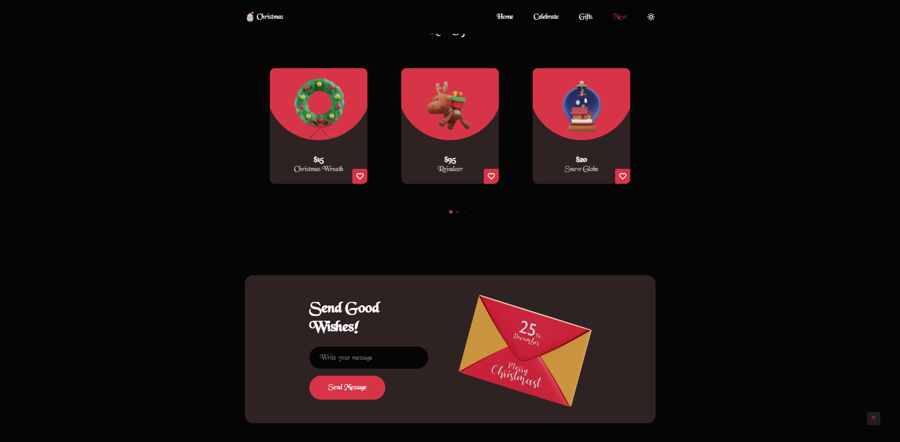

# Responsive Christmas Website ⛄️

## Responsive Christmas Website ⛄️

- Responsive Christmas Website Using HTML CSS & JavaScript
- Contains animations when scrolling.
- Smooth scrolling in each section.
- Includes a dark and light mode.
- Developed first with the Mobile First methodology, then for desktop.
- Compatible with all mobile devices and with a beautiful and pleasant user interface.

### Assets

*  [Icons](https://boxicons.com/)
* [Swiper](https://swiperjs.com/)
* [Scroll Reveal](https://scrollrevealjs.org/)
* [Font](https://www.1001fonts.com/blackchancery-font.html)
* [Inspiration](https://www.youtube.com/channel/UCgkDs77BoEhMIgRUB4MKrtQ)
